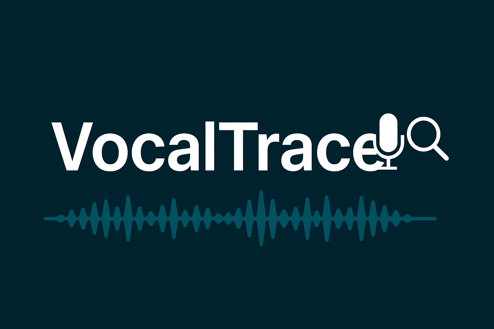
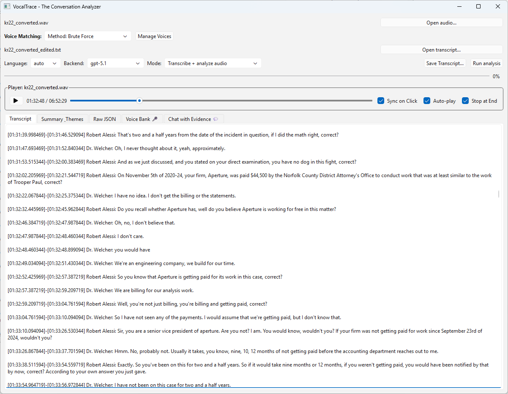
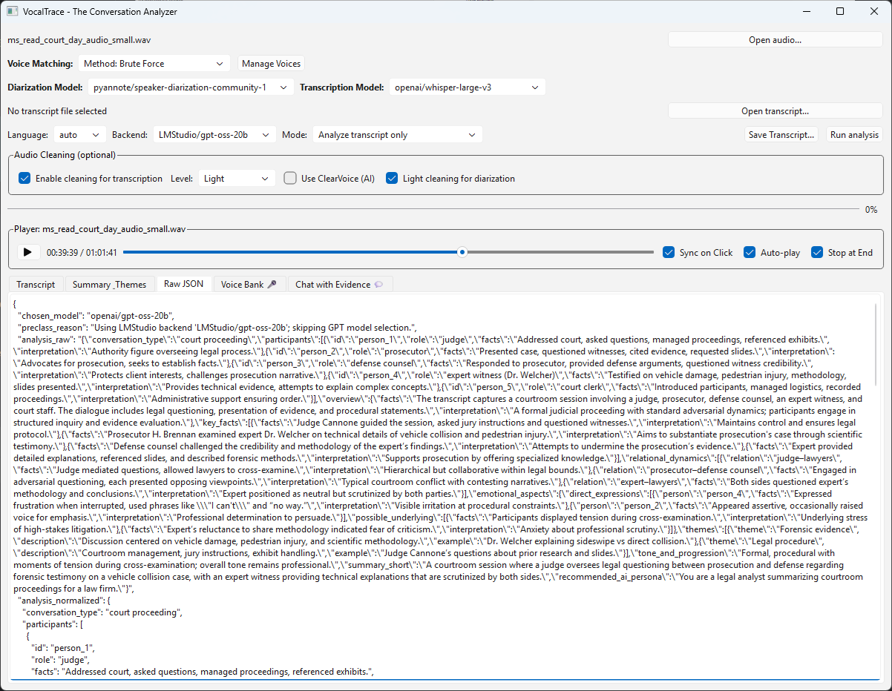
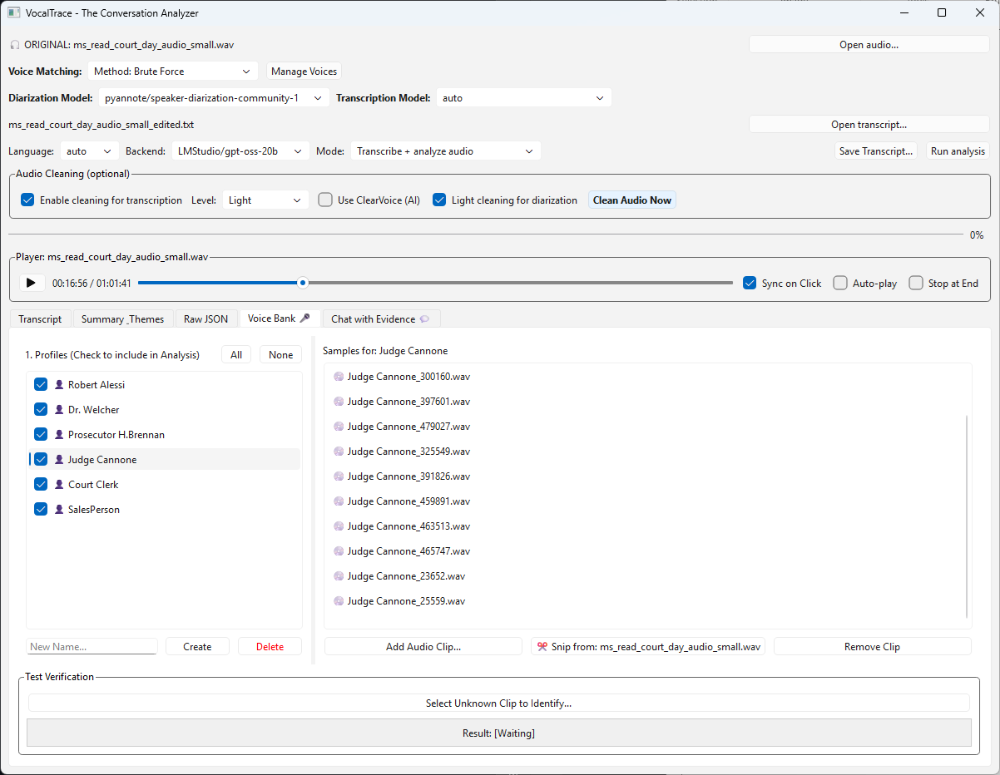
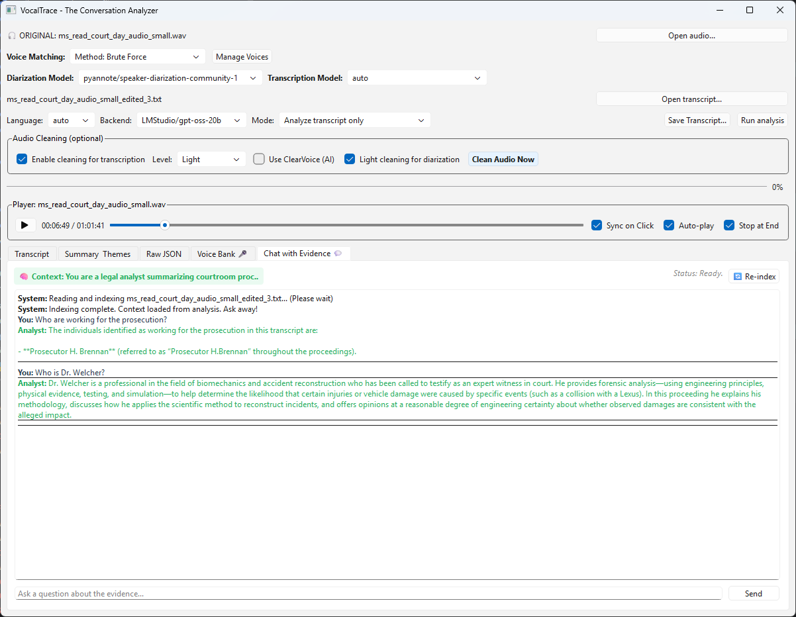
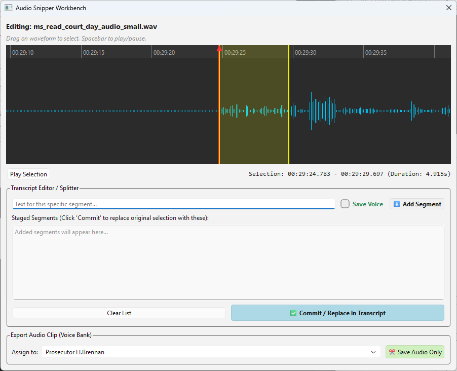

<p align="center">
  
</p>

# VocalTrace v0.3

**Forensic-grade conversation analyzer & speaker identity workbench** VocalTrace is a GUI-driven tool designed for investigators and researchers to transform raw audio into verified, searchable intelligence. It combines state-of-the-art diarization (Pyannote) and transcription (Whisper) with a robust "Human-in-the-Loop" verification workflow.

**Intended audience**
- Investigators / analysts working with recorded conversations
- Researchers validating diarization & transcription results
- Developers exploring human-verified AI pipelines
---
## Key Improvements in v0.3
* **Decoupled Cleaning Pipeline:** Clean your audio once as an explicit first step, ensuring consistent results across transcription, diarization, and the Snipper.
* **Truth Persistence:** Manually corrected segments (Ground Truth) are locked—AI re-runs will never overwrite your manual work.
* **Enhanced Windows Stability:** Removed Conda FFmpeg dependencies to eliminate DLL conflicts with PySide6/Qt.
* **Audio Snipper Workbench:** A precision tool for splitting, merging, and "voice printing" speakers with surgical accuracy.

---

## User Interface

_Segmented, speaker-labeled transcript with waveform-linked playback (“sync-on-click”)._



_LLM summary, psychological profile, themes_



_Manage known speakers and biometric signatures_



_Lets you chat with the transcript using RAG + LLM_



_Precision audio labeling tool + commit corrected segments to Voice Bank_


---
## Features

- **Speaker diarization** (Pyannote) with progress feedback
- **Transcription** (Whisper / Transformers pipeline)
- **Audio cleaning** via `AudioDenoiser` (noise reduction + filters + normalization)
- **Voice bank / biometrics** utilities (experimental)
- **LLM analysis** (OpenAI / Gemini) and optional RAG tooling
- **Ground truth persistence** – manually verified segments are locked and never overwritten by re-runs
---

## Quick start (Windows / Linux / macOS)

### 1) Clone
```bash
git clone https://github.com/Rakile/VocalTrace.git
cd VocalTrace
```

### 2) Create a Python env
Use either `venv` or Conda.

**venv (recommended for GUI stability on Windows)**
```bash
python3.12 -m venv .venv
# Windows
.venv\Scripts\activate
# Linux/macOS
source .venv/bin/activate
```

**Conda (OK, but do NOT install conda ffmpeg)**
```bash
conda create -n vocaltrace python=3.12
conda activate vocaltrace
```

### 3) Install PyTorch
Pick the command that matches your platform/CUDA. See the official selector at pytorch.org.

Example (CUDA 12.8 wheels):
```bash
pip install torch==2.8.0 torchaudio==2.8.0 --index-url https://download.pytorch.org/whl/cu128
```

### 4) Install Python deps
```bash
pip install -r requirements.txt
```

### 5) Install **system ffmpeg** (required)
VocalTrace uses an **ffmpeg executable** to decode audio for diarization/transcription when needed.

- **Windows:** install ffmpeg and ensure `ffmpeg.exe` is on PATH (or set `VOCALTRACE_FFMPEG`)
- **Linux:** `sudo apt-get install ffmpeg`
- **macOS:** `brew install ffmpeg`

If ffmpeg is not on PATH, set:
```bash
# Windows (PowerShell)
$env:VOCALTRACE_FFMPEG="C:\path\to\ffmpeg.exe"

# Linux/macOS
export VOCALTRACE_FFMPEG=/usr/bin/ffmpeg
```
> ⚠️ **Important (Windows):** Do NOT install ffmpeg via Conda in this environment.
> Conda ffmpeg causes DLL conflicts with PySide6/Qt.

### 6) The "ClearVoice" Option (Important)

VocalTrace supports **ClearVoice** for AI-based speech enhancement. Because it has strict version requirements, it is not included in the default `requirements.txt`.

**To enable ClearVoice:**

1. Run `pip install clearvoice`.
2. **Crucial:** After installing clearvoice, you **must** re-run the main requirements to fix the version conflicts it creates:
```bash
pip install -r requirements.txt

```

## Configuration (API Keys)

Create an `.env` file in the root directory:

* `HF_TOKEN_TRANSCRIBE`: For Pyannote models.
* `GEMINI_TRANSCRIBE_ANALYSIS_API_KEY`: For Gemini 2.5 analysis.
* `OPENAI_API_KEY`: For GPT-4o/5.1 analysis.


### Optional: FlashAttention2 (lower VRAM, faster inference)

VocalTrace **automatically supports FlashAttention2** when available to reduce GPU memory usage and improve inference speed for Whisper-based models.

> FlashAttention2 is **optional**.
> If it is not installed or not supported on your system, VocalTrace **automatically falls back to standard (“eager”) attention** with no loss of correctness.

Internally, VocalTrace attempts to load models with:

```python
attn_implementation="flash_attention_2"
```

and transparently falls back to:

```python
attn_implementation="eager"
```

if FlashAttention2 is unavailable.

---

### Requirements & notes

* Requires a **compatible NVIDIA GPU**
* Supported for **fp16 / bf16** models
* Works best with recent PyTorch + CUDA builds
* Not required for CPU inference or smaller models

---

### Linux installation (often easiest)

On many Linux systems, FlashAttention can be installed directly via pip:

```bash
pip install flash-attn --no-build-isolation
```

If this fails, it usually means your CUDA / PyTorch toolchain is not compatible with building the extension locally.

---

### Windows installation (recommended: prebuilt wheels)

Building FlashAttention from source on Windows is often difficult.
The **recommended approach** is to install a **prebuilt wheel** that matches:

* Python version (e.g. `cp312`)
* PyTorch version (e.g. `torch2.8`)
* CUDA version (e.g. `cu128`)
* Architecture (`win_amd64`)

Example source of Windows prebuilt wheels:

* [https://github.com/mjun0812/flash-attention-prebuild-wheels/releases](https://github.com/mjun0812/flash-attention-prebuild-wheels/releases)

Example filename:

```
flash_attn-2.8.2+cu128torch2.8-cp312-cp312-win_amd64.whl
```

Install with:

```bash
pip install flash_attn-2.8.2+cu128torch2.8-cp312-cp312-win_amd64.whl
```

Verify:

```bash
python -c "import flash_attn; print('flash-attn OK')"
```

---

### Troubleshooting

* If FlashAttention fails to load, VocalTrace will log a warning and continue using eager attention.
* No configuration changes are required to disable FlashAttention manually.
* If you encounter crashes during model loading, uninstall `flash-attn` and retry — VocalTrace will still function normally.

---

### 7) Run
```bash
python launch.py
```

---

## Troubleshooting

### PySide6 / Qt import errors (Windows)
If you previously installed `ffmpeg` via **Conda** in the same environment and PySide6 fails to import, remove the conda ffmpeg package:
```bash
conda remove ffmpeg
```
Then use a **system ffmpeg executable** (see above).

### ffmpeg not found
If you see an error like “ffmpeg executable not found”, install ffmpeg or set `VOCALTRACE_FFMPEG`.

### Logging
Set log level with:
```bash
# Windows (PowerShell)
$env:VOCALTRACE_LOGLEVEL="DEBUG"

# Linux/macOS
export VOCALTRACE_LOGLEVEL=DEBUG
```

---

## The VocalTrace Workflow

VocalTrace follows a linear forensic process to ensure the highest data integrity:

### 1. Audio Preparation (Denoising)
Load your source file and use the **"Clean Audio Now"** feature. This uses the `AudioDenoiser` engine to create a high-quality "Working Copy" (`_cleaned.wav`) while preserving your original evidence. Once cleaned, the entire app (including the Snipper) automatically switches to this improved source.

### 2. Diarization & Identity
The engine detects "who spoke when." Use the **Voice Bank** to match detected clusters against known biometric signatures. v0.3 supports in-memory processing to avoid disk-thrashing.

### 3. Verified Transcription
Run the Whisper-based transcription on your cleaned audio. 
* **Refinement:** Right-click any segment in the transcript to open the **Snipper**. 
* **Commit:** Adjust boundaries, correct text, and click **Commit**. Committed segments turn **Green** and are stored as "Verified Ground Truth."

### 4. Evidence Chat (RAG)
Use the "Chat with Evidence" tab to query your transcript. The system uses **Retrieval-Augmented Generation** to answer questions based *only* on the provided transcript, complete with a dynamic persona (e.g., "Forensic Accountant") generated during initial analysis.

## Project layout

- `launch.py` – entrypoint (adds `src/` to path and starts the Qt app)
- `src/main.py` – main Qt window + tabs
- `src/transcription_engine.py` – diarization + transcription orchestration
- `src/AudioDenoiser.py` – audio cleaning pipeline (authoritative audio processing)
- `src/ui/*` – GUI tabs and helpers
- `voices/` – voice samples / bank

---

## ⚖️ License

VocalTrace is licensed under the **MIT License**. (See `LICENSE.txt` for details).
*Note: We recommend the MIT license for software over CC-BY to ensure compatibility with open-source repositories.*
